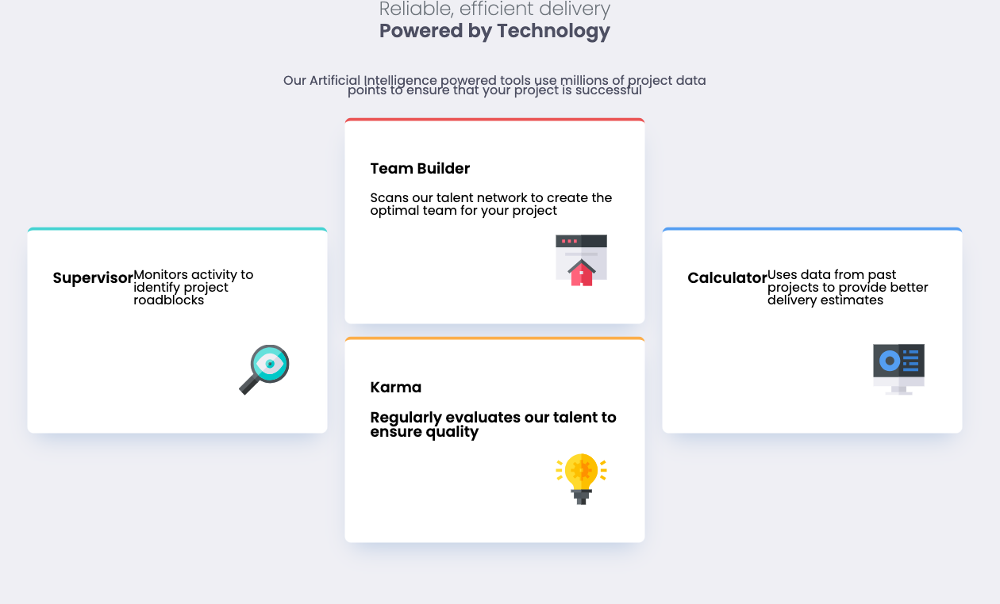

# Frontend Mentor - Four card feature section solution

This is a solution to the [Four card feature section challenge on Frontend Mentor](https://www.frontendmentor.io/challenges/four-card-feature-section-weK1eFYK). Frontend Mentor challenges help you improve your coding skills by building realistic projects.

## Table of contents

- [Overview](#overview)
  - [The challenge](#the-challenge)
  - [Screenshot](#screenshot)
  - [Links](#links)
- [My process](#my-process)
  - [Built with](#built-with)
  - [What I learned](#what-i-learned)
- [Author](#author)

## Overview

### The challenge

Users should be able to:

- View the optimal layout for the site depending on their device's screen size

### Screenshot

### Links

- 📁 [Solution repository](https://github.com/Bruchno/Four-card-feature-section)
- 🌐 [Live demo](https://bruchno.github.io/Four-card-feature-section/)

## My process

### Built with

- Semantic HTML5 markup
- CSS custom properties
- Flexbox
- CSS Grid
- Mobile-first workflow

### What I learned

How to structure responsive cards using CSS Grid for precise control over element order and alignment

How to avoid horizontal scrolling on mobile devices by optimizing widths, padding, and layout constraints

How to implement card appearance animations for a more dynamic and engaging visual experience

## Author

- GitHub – [Bruchno](https://github.com/Bruchno)
- Live site – [bruchno.github.io/Four-card-feature-section](https://bruchno.github.io/Four-card-feature-section)

